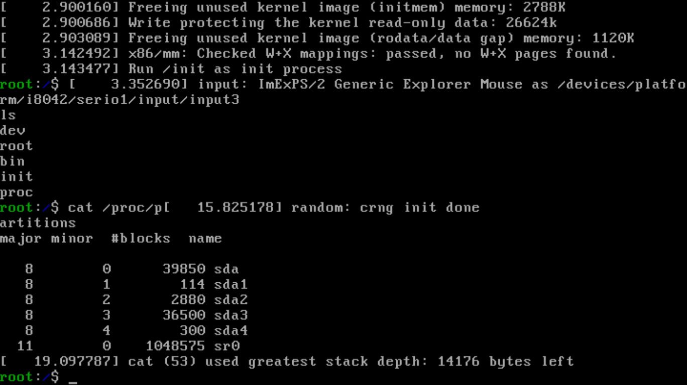

# mlinux

This is an internal experiment building the Linux kernel
with minimal static utilities and seeing how to set up
a working environment.

# building

You'll need `grub`, `git`, `gcc`, `grub-rescue`,
and a bunch of other stuff listed in `depends.sh`
to compile the Linux kernel and then set up
a bootable image.

After cloning this repository, you'll want to run
`makeclones.sh` to pull the Linux Kernel's source,
then you'll want to run `make configure` in
the `./kernel` directory and make sure it's all set up
to your tastes.

Afterwards, building a bootable UEFI `*.iso`
should be just as simple as running the `./build` script

# current state

The current version mounts `/proc`
and boots but does no additional work;
you'll have access to a tiny `cat`-like
utility for reading the contents of a file
(to be replaced later), a hexidecimal
editor named [nex](https://github.com/modula-dev/nex), and a very minimal `shell`.
Currently, this build does not have a
`shutdown` command of any kind,
and it doesn't actually mount the file system
yet, but I plan to handle that soon.

# planned build

Eventually, this build will include
the [`m`](https://github.com/modula-dev/m)
compiler commandline interface with
the `garter` and `gasm` frontends installed,
a very small desktop (likely based off `BerryWM` or something similar),
a permissions application,
and some utilities for downloading
applications

I'd like to have it so that each installed
application is put into its own directory
something like `/app/{name}` that internally
contains symbolic links to places it needs like
`/home/{user}/Desktop` and where each application
has separated permissions managed through
a centralized permissions application.
When a user wants to run, say, `texteditor`,
the application is run as that user
with their permissions preset for that application.

## Why Linux?

Really for no other reason than I didn't want to write a kernel from scratch. I wanted to write the userland, not the entire kernel from scratch. I'd like to write this in a way where it's trivial to port over to other systems like tilck, the BSD kernel, or even something custom-made, but I'll likely stick with Linux for now.

## Purpose

Just exists for fun, mostly, but also as a proof-of-concept for the specific permissions system I'm interested in, and also for testing statically compiled binaries made with my compiler toolchain. This is a pet project, for sure